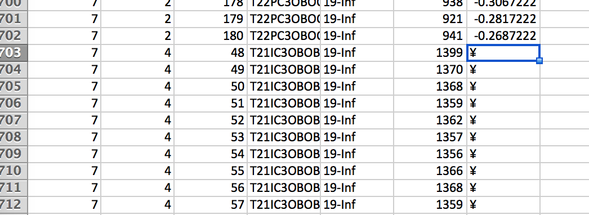
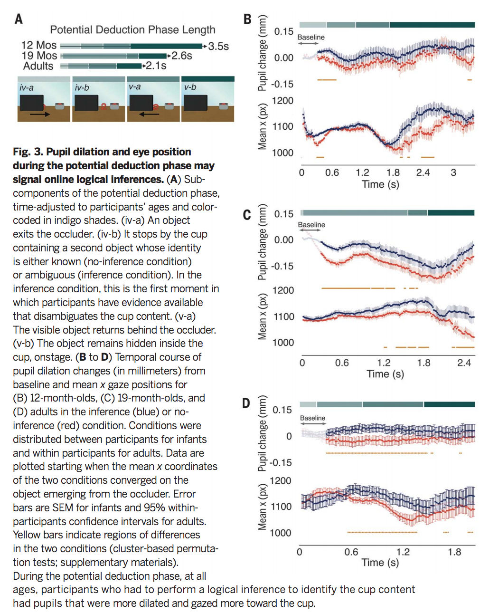

```{r}
knitr::opts_chunk$set(warning=F, cache=T, message=F)
```

```{r}
source("permutation_helpers.R")
library(magrittr); library(tidyverse)
theme_set(ggthemes::theme_few())
```

## Read the timecourse data

From Cesana-Arlotti et. al.'s codebook:

> In each file, data were stored with the following columns:

	* Participant % Participants' ID number.
	* Trial % The trial corresponding to the data point.	
	* Bin	% Indicates the frame in which the data was collected by the Eyectracker (60 Hz)
	* MovieID % Unique Scenes ID 
	* Experiment %  indicates the age group and the Inference vs No_Inference condition
	* X	% The average gaze position on the X-axis in the corresponding bin (see main text and SOM).
	* PD %  The average change in pupil diameter from the baseline in the corresponding Bin (see main text and SOM).

```{r read adult data}
data_path_adults <- "../data/AdultsData"
files_adults <- list.files(data_path_adults)
pd_files <- files_adults[str_detect(string = files_adults, pattern = "Pup")]
meanX_files <- files_adults[str_detect(string = files_adults, pattern = "MeanX")]

# get data frames for each DV (4 files for each; 8 total)
d_pd_adults <- pd_files %>% map_dfr(~ read_tsv(file.path(data_path_adults, .)))
d_meanx_adults <- meanX_files %>% map_dfr(~ read_tsv(file.path(data_path_adults, .)))
```

Note that we get parsing errors for the MeanPupil data:

  * 81 parsing failures in the `Inf_NoInf2_ScDown_Pup.txt` file
  * 157 parsing failure in the `Inf_NoInf1_ScDown_Pup.txt` file

Join the adult data. 

  * Note: if you just naively try to joing the data frames, you get a lot of extra rows added. This likely means there are multiple matches across the two datasets. After some digging, I found out this happens because of the `Count` variable being different across the dataframes, which doesn't make sense. I'm going to remove the column since it doesn't seem critical for the analyses, but I should so some more digging. 
  
```{r}
data_points <- d_meanx_adults %>% count(Participant) 
data_points$n_pd <- d_pd_adults %>% count(Participant) %>% pull(n)
data_points %<>% mutate(diff_n = n == n_pd)
data_points
```
  

```{r}
d_meanx_adults %<>% select(-Count)
d_pd_adults %<>% select(-Count)
d_adults <- left_join(d_meanx_adults, d_pd_adults, by = c("Participant", "Bin", "PhaseLabel", "InferenceCondition", "MovieID"))
```

Now let's check which participants are getting duplicates.

```{r}
data_points$n_after_join <- d_adults %>% count(Participant) %>% pull()
data_points %<>% mutate(diff_n = abs(n_after_join - n),  
                        diff_n_after_join = n == n_after_join) 
data_points
```
Ugh, all of them and it doesn't look systematic. TODO: some more digging on why the join isn't working like I expect it should.

For now, I'm just going to use bind_cols and see what the data looks like. This is riskier than the join approach because bind_cols() joins by position, so we are relying on the structure of the data files being identical. 

```{r}
d_adults <- bind_cols(d_meanx_adults, d_pd_adults %>% select(MeanPupil))
```

```{r read kid data}
data_path <- "../data/InfantsData/ByBin"
files <- list.files(data_path)
d <- files %>% map_dfr(~ read_tsv(file.path(data_path, .)))
```

Note that we are getting some parsing errors from the E3-byBin.txt data file. Here is the a summary of the issue: 

```{r}
problem_df <- read_tsv(file.path(data_path, files[1]))
problems(problem_df)
```

And here's what the data look like when viewed in excel:



My best guess is that this is an error in the Pupil Dilation computation output for trial 4 for participant 7. Let's check to see how read_tsv dealt with the parsing failure

```{r}
d %>% filter(Participant == 7, Trial == 4, Experiment == "19-Inf") %>% head()
```

`read_tsv()` just replaced these values with NAs -- seems reasonable. 

### Check out the data.

```{r}
glimpse(d)
glimpse(d_adults)
```

### Join adult and kid data

Varible creation and renaming. 

```{r}
# tidy up adult data
d_adults %<>% 
  mutate(age_group_bin = "adults",
         age_group = NA,
         InferenceCondition = ifelse(InferenceCondition == 1, "Inf", "NoInf"),
         Participant =  str_c(Participant, age_group_bin, sep = "_")) %>% 
  rename(trial_type = InferenceCondition,
         X = `EyeGaze(meanX)`,
         PD = MeanPupil) %>% 
  select(-PhaseLabel)

# tidy up kid data 
d %<>%
  mutate(age_group_bin = "children") %>% 
  separate(col = Experiment, into = c("age_group", "trial_type")) %>% 
  mutate(Participant =  str_c(Participant, trial_type, sep = "_"))
```

Now we join the two data frames together.

```{r}

```


### Check data

Write some data checks to cross-reference with the values reported in the paper. Mostly to check for parsing errors.

```{r}
d$Experiment %>% unique()
```

Gather pupil dilation and mean_x into one `measurement` variable.

```{r}
d %<>% gather(key = measurement_type, value = value, X:PD)
```

Convert Bins (60 HZ; 1 HZ = 16.67ms) to time (seconds).

```{r}
one_hz_in_ms <- 16.67
d %<>% mutate(time_ms = Bin * one_hz_in_ms,
              time_sec = time_ms / 1000) 
```

Check how many participants we have in each experiment and age group. 

```{r}
d %>% 
  distinct(Participant, age_group, trial_type) %>% 
  count(age_group, trial_type) 
```

This looks reasonable. Now we try to reproduce the timecourse plots and the cluster-based permutation analyses.

## Goal of permutation analysis

From Cesana-Arlotti et. al.:

> However, the main aim of our research is to explore behavioral correlates of inference drawing online. To this purpose, eye tracking data during the Potential Deduction phase, as well as measures that relate infants' behavior during this phase with their response to outcomes inconsistent with a potential deduction ... Below, we analyze pupil change, eye position onscreen and proportion of trials in which infants' eyes shifted from the visible object onstage to the cup in perceptually identical scenes that either invited or did not require a logical deduction (respectively, Inference condition, Experiment 3 and 4 and No-inference condition, Experiment 5 and 6)

### Measures:

* `pupil change`: pupil dilation has been found to be a marker for cognitive effort, memory load and attentional focus
* `proportion of trials shifting to cup` (inference vs. no-inference):  Shifts from the visible object to the cup are an indication that infants deploy a particular a scanning strategy during inference making
* `eye position onscreen` (Mean x gaze position onscreen): the variation of eye position onscreen as if it eyes were smoothly transitioning across different elements of the screen

## Participants & Data filters

I think the data were already filtered based on this criterion

> Infants' eye gaze data from Experiments 3-6 (N = 96) were analyzed. Trials in which less than 70% of the gaze samples were collected were excluded from analysis. With these criteria 4 participants were excluded (1 in Experiment 5 and 3 in Experiment 6) because no valid trial was retained.

## Target outcomes

1. higher pupil dilation in the inference condition 

2. a reorientation of focal attention toward the cup, as signaled by the temporal analysis of mean x and by the analysis of the proportion of trials with visible-object-to-cup shifts
  - proportion of trials with visible-object-to-cup shifts
  - temporal analysis of mean x gaze position

## Target stats

1. [KM: Where are the stats for the cluster-based analyses of pupil dilation and mean x???]

2. Proportion of tirals with with visible-object-to-cup shifts: We ran a two-way ANOVA with proportion of trials as the dependent variable, Age Group (12/19) and Condition (Inference/No-Inference) as an independent variables. As reported in the main text, the analysis revealed an effect of Condition, no effect of Age and no interaction. Infants shifted from the object to the cup in more trials when the Potential Deduction phase required an inference than when it did not (MInference = 71%, MNo_Inference = 50%; F(1, 88) = 10.4, P = 0.002; fig. S2). 

## Timecourse plots



### Mean x looking behavior

Aggregate over participants and time bins

```{r}
ss <- d %>% 
  group_by(Participant, trial_type, age_group, time_sec,
           measurement_type, Bin) %>% 
  summarise(ss_m = mean(value, na.rm = T))

ms <- ss %>% 
  group_by(trial_type, age_group, time_sec, 
           measurement_type, Bin) %>% 
  summarise(n = n(),
            m = mean(ss_m), stdev = sd(ss_m)) %>%
  mutate(se = stdev / sqrt(n),
         ci = 2 * se)
```

Make the key timecourse plot. TODO: add adult data from E7

```{r}
ms %>% 
  ggplot(aes(x = time_sec, y = m, color = trial_type)) +
  geom_line() +
  geom_linerange(aes(ymin = m - se, ymax = m + se), alpha = 0.7) +
  #geom_linerange(aes(ymin = m - ci, ymax = m + ci), alpha = 0.7) +
  facet_grid(measurement_type~age_group, scales = "free_y") +
  theme(legend.position = "top")
```

There are some differences between these plots and Figure 3 in the paper. First, the large baseline differences between inference and no-inferences in the 12-month-olds X-corrdinate data. Also, an overall point that these are not super convincing curves, and I'm not sure why the 19-month-olds' X-coordinate looking patterns look so different from the 12-month-olds.

## Analysis

> We analyzed the temporal dynamics of the mean x gaze coordinates (hereafter mean x) and the pupil changes in the same temporal region.

### Calculating pupil dilation

Pupil dilation were calculated as follows. 

  * First, we identified the first frame at which the mean x gaze did not differ statistically between the two conditions (Inference and No-Inference, unpaired t-test). The rationale for this choice is that starting from that frame we could be sure that the eyes were directed at the same area of the screen, and hence that the pupil was exposed to identical light sources in both conditions. Thus, any potential luminosity difference between conditions could not affect the dilation of the pupil at the relevant moment of the analysis. This choice was facilitated by the fact that the Potential Deduction phase started when an object exited the occluder. The sheer movement of the object onscreen led most participants in most trials to direct their gazes towards the exiting object, marking a quite clear moment in which their x gaze position would overlap, on average. 
  
  * Then, for each trial and for each participant, a baseline pupil diameter was computed by averaging the data samples in the first 300 ms after that frame. Such interval should be sufficient for the physiological response of the pupil to adapt to the lighting condition of each movie at the moment of interest. 
  
  * Second, for each successive data sample during the Potential Deduction phase, we computed the difference between raw pupil diameter and the baseline pupil diameter, trial by trial and participant by participant. 
  
Thus, pupil dilation changes reflected actual differences at each individual trial for each individual infant.

KM: they provided the computed pupil dilation, so we didn't actually compute this.

### Permutation analysis
 
Finally, for the pupil dilation changes as well as the mean x, we ran a cluster mass test coupled with a randomization procedure (24, 25). The details of our procedure were as follows. 

  * We computed unpaired t-tests at each time bin for the mean x gaze coordinates and the pupil dilation changes, separately for 12- and 19- month-olds. 
  * For pupil dilation changes, the tests were one-tailed because, based on our hypothesis and the literature, we expect an inference to have a cognitive cost resulting in higher pupil dilation, as for other cognitive activities implying higher effort. 
  * For mean x, the tests were two-tailed we have no hypothesis as to where infants look in the particular moments of the Potential Deduction phase we analyzed. 
  * Temporal cluster statistics were defined as the sum of the t values thresholded at p=0.05 on consecutive time bins. To evaluate the significance of the test, we recomputed the same analysis on 1000 sets of random permutations. The permutations were computed by randomly assigning the participants to the condition labels (Inference/No Inference), taking care to maintain the N of the two conditions identical to the N available for the original data.
  
```{r}
d_filt <- ss %>% filter(age_group == 12, measurement_type == "PD") # just start with one age group and one DV to build analysis
num_sub <- d_filt %>% 
  ungroup() %>% 
  select(Participant, trial_type) %>% 
  unique() %>% 
  count(trial_type) %>% 
  pull(n) %>% max()
```

```{r}
threshold_t <- qt(p = 1 - .05/2, df = num_sub - 1) # pick threshold t based on alpha = .05 two tailed
threshold_t_one_tailed <- qt(p = 1 - .05, df = num_sub-1) # pick threshold t based on alpha = .05 one tailed
```

## Rolling my own permutation analysis

First, we need to get the summed t-statitistic that provides the strongest evidence of a difference between the two trial types. We do this by looking for clusters of significant differences in the timecourse, with clusters defined by adjacency in time.

Concretely, we run a statistical test on each time-bin of the data (here an unpaired t-test). This can be any valid and appropriate statistic test that quantifies the probability of the effect: 

```{r}
# nest the data by time bin 
by_bin <- d_filt %>% 
  group_by(Bin) %>% 
  nest()
```

KM note: I ran into a bug when trying to map the t-test to each time bin. There are two extra time bins in the No-Inference condition. So we need to find the max time bin that both conditions have and use that as the upper bound.

```{r}
bin_cut_point <- d_filt %>% 
  group_by(trial_type) %>% 
  summarise(max_bin = max(Bin)) %>% 
  pull(max_bin) %>% 
  min()

by_bin %<>% filter(Bin <= bin_cut_point)
```

Map the t-test to each time bin and store it as a variable in the by_bin data frame. 

```{r}
by_bin %<>% mutate(model = map(data, run_t_test, alternative = "greater"))
```

2. Take the time-bins whose test passed the threshold statistic (e.g., t > 2), and group them by adjacency. We will call these time-clusters. To do this, we extract the t-stats and their bin numbers and filter by the threshold defined above.

```{r}
# get t-stats for each model
t_df <- by_bin %>% 
  mutate(glance = map(model, broom::glance)) %>% 
  unnest(glance, .drop = TRUE) %>% 
  select(Bin, statistic, p.value)

# filter by t threshold 
t_df_filt <- t_df %>% filter(statistic >= threshold_t)
t_df_filt
```

3. For each time-cluster, calculate the sum of the statistics for the time-bins inside it.

The technical challenge here is to figure out how to define the clusters based on the Bin vector. Here is my solution: 

```{r}
t_df_filt %<>% define_clusters(.)
t_df_filt
```

We can see that we get three clusters of t-stats that passed the threshold.

Next, we calculate the sum of the statistics for the time-bins inside each cluster.

```{r}
obs_t <- t_df_filt %>% 
  group_by(cluster) %>% 
  summarise(sum_t = sum(statistic)) 

obs_t
```

Take the largest of the cluster-level statistics and store it for later. This is the t-value that we will use to compare against our null distribution generated by the permutations that we will create in the next part of the program.

```{r}
largest_t <- obs_t %>% pull(sum_t) %>% max()
largest_t
```

### Generate null distribution by shuffling data

We will take our data and randomly shuffle it, assigning participants randomly to each condition. Then we will perform steps (1)-(3) on the shuffled dataset and save the biggest sum-statistic from each permutation analysis. 

TODO: figure out whether we should be shuffling and resassigning at the level of the Mean X and PD timecourse data? Right now, we are shuffling the aggregated trial-level data. 

A note from the supplemental materials in Cesana-Arlotti et. al., (2018):  

> To evaluate the significance of the test, we recomputed the same analysis on 1000 sets of random permutations. The permutations were computed by randomly assigning the participants to the condition labels (Inference/No Inference), taking care to maintain the N of the two conditions identical to the N available for the original data.

So we create a list of data frames. Each data frame is a permuted dataset.

```{r, message=F}
# global variables for setting up shuffling and 
set.seed(7)
n_permutations <- 1000
list_dfs <-  vector("list", length(1:n_permutations))

system.time(
  for (n_sim in n_permutations) {
    list_dfs[[n_sim]] <- permute_data(d_filt)
  }
)
```

Now that we have our list of permuted datasets, we map the statistical test using a wrapper function to each time bin in each dataset. 

Note that this takes about 4.5 minutes to do 1000 permutations.

```{r}
system.time(
  null_dist_1 <- map(list_dfs, t_test_by_bin, alternative = "greater", bin_cut = bin_cut_point)
)
```

Next, we need to extract the t-stats, filtering by the pre-defined threshold. Note that this takes about 4.5 minutes to do 1000 permutations.

```{r}
system.time(
 null_dist_2 <- map(blah, extract_t, t_threshold = threshold_t) 
)
```

Then, we make clusters for each filtered data frame of Bins that have above-threshold t-values. TODO: What to do if there weren't any significant t-stats during the by_bin pass? Right now, I'm just ignoring these simulations

```{r}
system.time(
  null_dist_3 <- map(blah2, define_clusters)  
)
```

Then, we sum the t-stats for each cluster and store the largest value for each simulation. TODO: What to do if there weren't any significant t-stats during the by_bin pass? Right now, I'm just ignoring these simulations.

```{r}
system.time(
  null_dist_4 <- map(blah3, sum_t_stats) %>% unlist() %>% data.frame(null_t = .)  
)
```

Now we have a data frame with a single column that is a distribution of t-stats from the randomly shuffled datasets. We can use this as a null distribution against which we can compare the cluster-statistic measured from our actual data in step (3). This will get us a p-value, or the probability of that we would have observed our data or something more extreme if the null were true.

We can visualize this null distribution along with our sample sum-statistic.

```{r}
null_dist_4 %>% ggplot(aes(x = null_t)) + 
  geom_histogram() +
  geom_vline(xintercept = largest_t, 
             color = "red", 
             linetype = "dashed",
             size = 1)
```

Finally, to compute the p-value we compare the cluster-statistic from step (3) to the distribution found in (6). 

```{r}
nulls <- null_dist_4 %>% 
  filter(!is.na(null_t)) %>% 
  mutate(sig = null_t >= largest_t) %>% # test if the null-sum stat is greater than the the sum-stat for the largest cluster
  pull(sig)

crit_p <- ( sum(nulls) / length(nulls) ) %>% round(3) # get the p-value rounded to 3 digits
crit_p
```

### Appendix

Some interesting points and caveats about the permutation approach from Marvis and Oostenvald (2007):

> The p-values for all eight clusters
are calculated under the permutation distribution of the maximum
(absolute value) cluster-level statistic and not under the
permutation distribution of the second largest, third largest, etc.
The choice for the maximum cluster-level statistic (and not the
second largest, third largest, etc.) results in a statistical test that
controls the FA rate for all clusters (from largest to smallest), but
does so at the expense of a reduced sensitivity for the smaller
clusters (reduced in comparison with a statistical test that is specific
for the second, third, ..., largest cluster-level statistic).

> This is a test statistic for a one-sided test; for a two-sided test, we select test statistics whose absolute value is larger than some threshold (in step 2) and we take the cluster-level statistic that is largest in absolute value (in step 4). Also, for a two-sided test, the clustering in step 3 is performed separately for samples with a positive and a negative t-value.

> The cluster-based test statistic depends on the threshold that is used to select samples for clustering. In our example, this thresh- old was the 97.5th quantile of a T-distribution, which is used as a critical value in a parametric two-sided t-test at alpha-level 0.05. As will be shown later in Section 4, this threshold does not affect the FA rate of the statistical test. However, this threshold does affect the sensitivity of the test. For example, weak but long-lasting effects are not detected when the threshold is large.